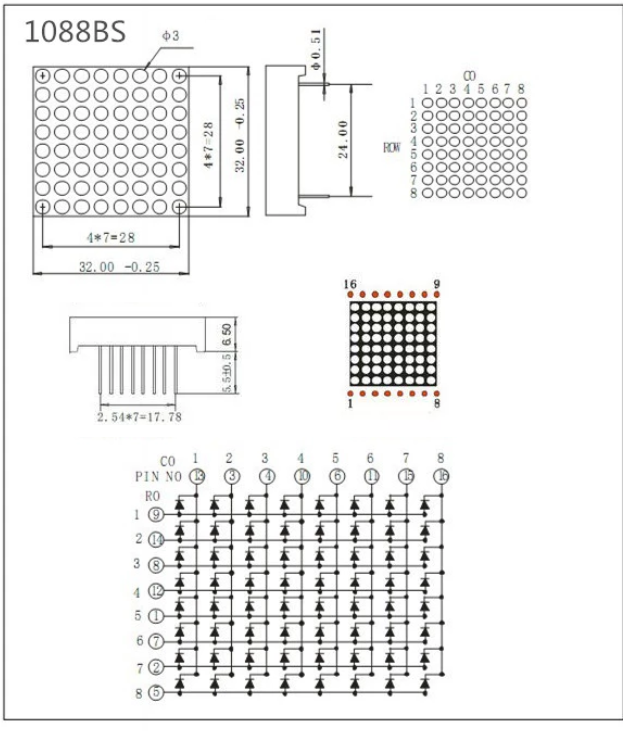

# 8x8 LED Matrix Control Program with Docker and VSCode Setup

This README offers documentation for a two-part project consisting of an 8x8 LED matrix (1088-BS) control program for Arduino and a Docker-based development environment configured within Visual Studio Code (VSCode) for a seamless and consistent development workflow.

## Project Components

### 1. 8x8 LED Matrix Control Program

The Arduino program controls an 8x8 LED matrix, displaying various predefined patterns. It incorporates a debounce mechanism for button input, allowing users to cycle through patterns such as letters, shapes, and symbols.

#### Features

- Debounce button input for cycling through patterns.
- Predefined patterns: heart, smiley, arrow, and more.
- Configurable display interval and pattern cycling.
- Serial output for debugging and interaction.
- Modular design for easy addition of new patterns.

### 2. Docker and VSCode Development Environment

A Dockerfile along with a `.devcontainer` configuration for VSCode is provided, enabling development within a Docker container. This setup encapsulates all necessary tools and extensions for developing, building, and debugging the Arduino project.

#### Docker Environment Highlights

- Python and PlatformIO for Arduino development.
- Pre-installed VSCode extensions to enhance productivity and code quality.
- Configurations for a consistent and reproducible development environment across different machines.

## Setup and Usage

### Hardware Setup

1. **Arduino and 8x8 LED Matrix Connection:** Wire the 8x8 LED matrix and a pushbutton to your Arduino board according to the pin mappings specified in the program.



## Connection Diagram: Arduino to 8x8 LED Matrix

The following outlines how each pin on the Arduino is connected to the corresponding pin on the 8x8 LED matrix based on the provided pin mappings. This setup is crucial for controlling the LED matrix accurately.

### Column Pins:

- `Arduino Pin 2`  -> Matrix col 1 (Datasheet Pin 13)
- `Arduino Pin 3`  -> Matrix col 2 (Datasheet Pin 3)
- `Arduino Pin 4`  -> Matrix col 3 (Datasheet Pin 4)
- `Arduino Pin 5`  -> Matrix col 4 (Datasheet Pin 10)
- `Arduino Pin 6`  -> Matrix col 5 (Datasheet Pin 6)
- `Arduino Pin 7`  -> Matrix col 6 (Datasheet Pin 11)
- `Arduino Pin 8`  -> Matrix col 7 (Datasheet Pin 15)
- `Arduino Pin 9`  -> Matrix col 8 (Datasheet Pin 16)

### Row Pins:

- `Arduino Pin 10` -> Matrix row 1 (Datasheet Pin 9)
- `Arduino Pin 11` -> Matrix row 2 (Datasheet Pin 14)
- `Arduino Pin 12` -> Matrix row 3 (Datasheet Pin 8)
- `Arduino Pin 13` -> Matrix row 4 (Datasheet Pin 12)
- `Arduino Pin 14` -> Matrix row 5 (Datasheet Pin 1)
- `Arduino Pin 15` -> Matrix row 6 (Datasheet Pin 7)
- `Arduino Pin 16` -> Matrix row 7 (Datasheet Pin 2)
- `Arduino Pin 17` -> Matrix row 8 (Datasheet Pin 5)

**Notes:**

- The "column pins" on the Arduino control the matrix columns. Setting a column pin to LOW activates that column.
- The "row pins" on the Arduino control the matrix rows. Setting a row pin to HIGH (for common cathode matrices) activates that row.
- Ensure correct connections based on the matrix's configuration (common anode or common cathode). This diagram assumes a common cathode configuration.
- Incorporate resistors appropriately to protect the LEDs from excessive current. Typically, resistors are placed in series with the row or column lines, depending on the matrix design.


### Software Setup

#### Docker and VSCode Configuration

1. **Build the Docker Image:** Use the provided Dockerfile to build an image that includes all necessary dependencies for the project.

    ```bash
    docker build -t arduino-development .
    ```

2. **VSCode and Docker Extension:** Ensure you have the Docker extension for VSCode installed. This extension simplifies managing Docker images and containers directly from VSCode.

3. **Open in Container:** With the project opened in VSCode, use the Remote - Containers extension to reopen the project inside the Docker container. This action will automatically configure the development environment based on the `.devcontainer/devcontainer.json` file.

#### Program Development and Deployment

- **Modifying and Uploading the Program:** Use PlatformIO within the containerized VSCode environment to modify, build, and upload the Arduino program.
- **Pattern Cycling:** Use the connected button to cycle through the LED matrix patterns.
- **Serial Monitoring:** Utilize the serial monitor in VSCode to view debug outputs and monitor the current pattern display.

### Extending the Project

- **New Patterns:** Expand the program with new LED matrix patterns by defining additional byte arrays and updating the pattern array.
- **Adjusting Debounce and Interval:** Fine-tune the button's debounce behavior and the pattern switching interval by modifying the respective variables.


### Images 


## Contributing

Your contributions to improve the project are welcome. Please use GitHub to submit pull requests or issues for bugs, features, or enhancements.

## License

The project is released under the MIT License, facilitating open and permissive usage, modification, and distribution.

## Author

**Bayron Cabrera**

- **GitHub:** https://github.com/bdcabreran
- **LinkedIn:** https://www.linkedin.com/in/bayron-cabrera-517821124/
- **Email:** bayron.nanez@gmail.com

